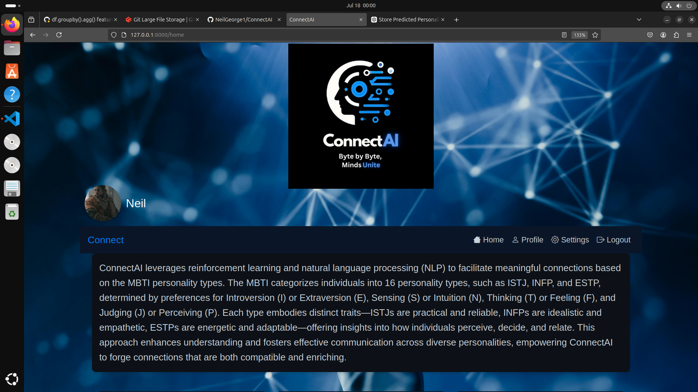
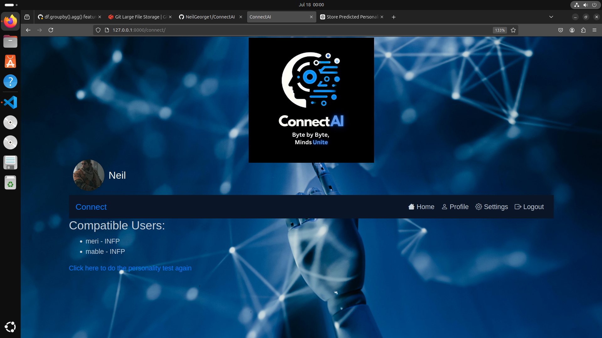

# ConnectAI

ConnectAI is a web application that leverages the Myers-Briggs Type Indicator (MBTI) dataset to predict users' personality types and connect them with compatible personalities. Using natural language processing (NLP) and machine learning techniques, ConnectAI aims to foster meaningful connections between users based on their personality compatibility.

## Features

- **Personality Prediction**: Analyze user input to predict their MBTI personality type.
- **Compatibility Matching**: Connect users with others who have compatible personality types.
- **User Profiles**: Users can create and update their profiles with their predicted personality type.
- **Seamless Integration**: Easy-to-use interface for a smooth user experience.

## Screenshots

### Home Page

*The main page where users can start the personality test.*

### Compatible Users

*List of users with compatible personality types.*
